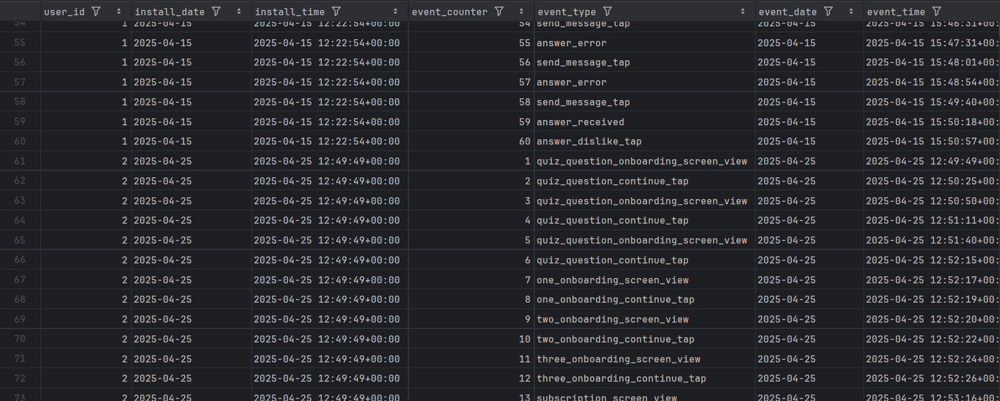
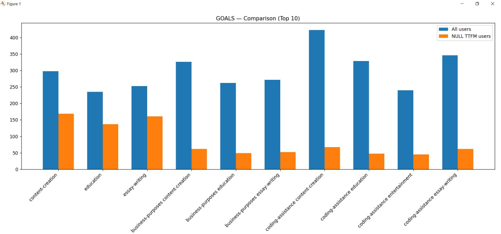
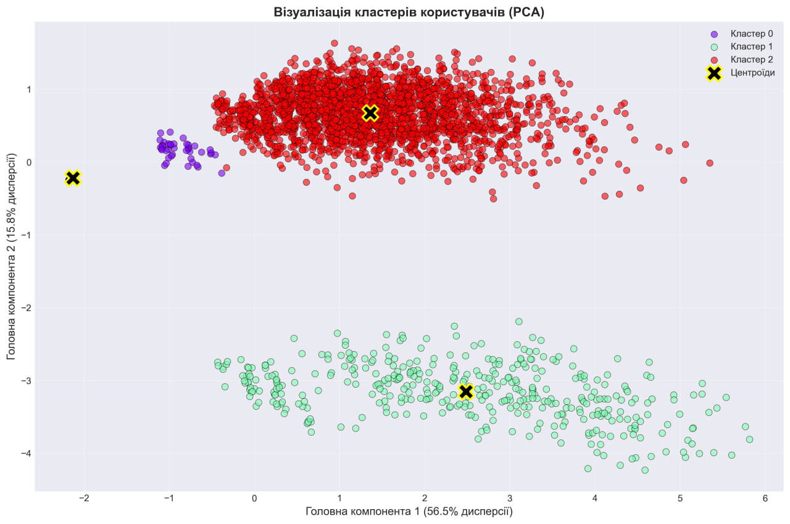
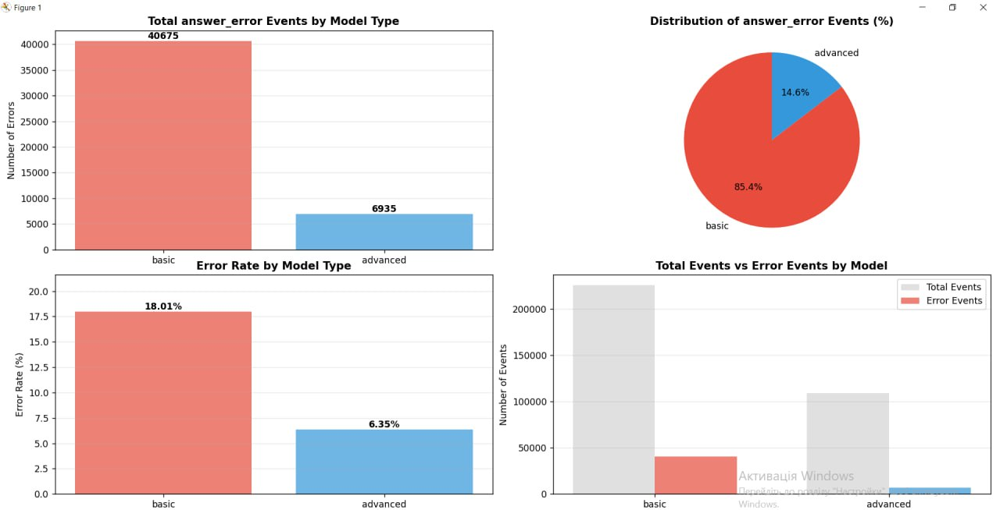
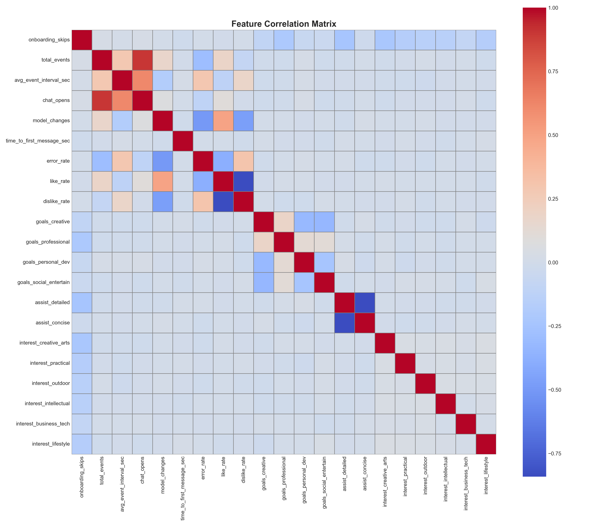

# АНАЛІЗ ВІДТОКУ КОРИСТУВАЧІВ
## У МОБІЛЬНОМУ ЗАСТОСУНКУ

---

## МЕТА ДОСЛІДЖЕННЯ

**Виявити поведінкові патерни користувачів**
**та визначити фактори, що впливають на відтік**

- Порівняти поведінку різних сегментів
- Описати відмінності під час онбордингу та взаємодії
- Класифікувати користувачів із NA
- Запропонувати конкретні зміни в продукті

---

## СТРУКТУРА ДАТАСЕТУ

**590,079** коректних записів
**92,650** записів з NA статусом
**13** невалідних записів

---

## EXPLORATORY DATA ANALYSIS

### **Питання для дослідження:**

1. Які характеристики описують поведінку користувачів?
2. Чи є відмінності між retained та churned?
3. Чи є зв'язок між діями та відтоком?
4. Як попередня поведінка впливає на рішення?

---

## 1.1 ДЕСКРИПТИВНІ ХАРАКТЕРИСТИКИ

### **Активність використання**
- messages_sent, messages_received
- chat_views, total_events

### **Оцінка задоволеності**
- likes, dislikes, Like/Dislike ratio

### **Якість сервісу**
- error_rate

---

## 1.1 Відтік на етапі онбордингу

---

## 1.2 КЛАСТЕРИЗАЦІЯ КОРИСТУВАЧІВ

**Виявлено 3 кластери користувачів**

---

## 1.2 ХАРАКТЕРИСТИКИ КЛАСТЕРІВ

### **Кластер 0**
Значно нижча активність за інші

### **Кластер 1**
Значно менший відтік

### **Кластер 2**
Значно більше помилок

---

## 1.2 ВІДМІННОСТІ МІЖ СЕГМЕНТАМИ

### **Retained користувачі:**
- Висока активність
- Відносно низький error_rate

### **Churned користувачі:**
- Дуже низький error_rate (ранній відтік)
- Або дуже високий error_rate (пізній відтік)

---

## 1.3 ВПЛИВ МОДЕЛІ НА ВІДТІК   

---

## 1.3 ВПЛИВ МОДЕЛІ НА ВІДТІК

### **Базова модель:**
- Retention rate: **~13%**
- Високий error_rate

### **Advanced модель:**
- Менше користувачів
- Значно менше помилок
- Вищий retention

---

## 1.3 ПРОБЛЕМНІ ІНТЕРЕСИ

Користувачі з інтересами **content-creation**, **education**, **essay-writing** швидше відпадають навіть не купивши

---

## 1.4 ФАКТОРИ ВПЛИВУ НА ВІДТІК

### **Критичні фактори:**

1. **Використання моделі**
   Для базової набагато більший відтік

2. **Отримання помилок**
   Високий error_rate призводить до churn

3. **Довге використання**
   Чим довше час користування застосунком, тим менший шанс відтоку

---

## 1.4 ОБҐРУНТУВАННЯ ВИБОРУ ФАКТОРІВ

**Для кластеризації вибрали компоненти з найбільшою кореляцією з is_churned:**

- answer_errors
- avg_event_interval_sec
- chat_opens, chat_views
- dislikes, likes
- error_rate
- messages_received, messages_sent
- total_events

---

## 1.5 КОРЕЛЯЦІЙНА МАТРИЦЯ

---

## ЗАГАЛЬНА ІНФОРМАЦІЯ

### **3 класи користувачів:**

**1. Ранній відтік**
Покидають застосунок зразу після онбордингу, відмовившись від преміум - підписки

**2. Пізній відтік**
Відтікають після тривалого використання, внаслідок високого error_rate

**3. Активні користувачі**
Не відтікають, мають низький error_rate

---

## ПРИЧИНИ ВІДТОКУ

### **Виявлені проблеми:**

1. **Висока кількість помилок базової версії**
   error_rate ~9% для churned vs ~3% для retained

2. **Невідповідність інтересам**
   content-creation, education, essay-writing

3. **Бар'єр монетизації**
   Відмова від преміум після онбордингу

---

## 2. PREDICTIVE MODELING

### **Розроблені моделі:**

- Логістична регресія
- Random Forest

**Мета:** спрогнозувати чи користувач скасує підписку

---

## 2. ХАРАКТЕРИСТИКИ МОДЕЛІ

---

## 2. МЕТРИКИ ЕФЕКТИВНОСТІ

---

## 2. МЕТРИКИ ЕФЕКТИВНОСТІ

ACCURACY............ 0.9640 (±0.0043)
PRECISION........... 0.9835 (±0.0032)
RECALL.............. 0.9636 (±0.0043)
F1.................. 0.9735 (±0.0031)
ROC_AUC............. 0.9934 (±0.0018)

---

## 2. FEATURE IMPORTANCE

Найважливіші фактори для прогнозування відтоку

---

## РЕКОМЕНДАЦІЇ: ТЕХНІЧНІ

### **1. Покращити стабільність**
- Базова модель: **критично**
- Преміум модель: бажано
- Таргет: error_rate < 5%

### **2. Промо advanced моделі**
- Наголосити на перевагах відносно базової версії
- Таргет: базові користувачі

---

## РЕКОМЕНДАЦІЇ: ПРОДУКТОВІ

### **Retention для проблемних інтересів:**

- Розробити спеціальні фічі для:
  - content-creation
  - education
  - essay-writing

- Запропонувати при онбордингу
- Провести AB-тестування
- Додати нові опції

---

## ПІДСУМОК

**Проаналізовано:** 590,079 подій, 10,218 користувачів
**Виявлено:** 3 кластери поведінки
**Критичні проблеми:**
- Високий error_rate базової моделі
- Низький retention специфічних інтересів

**Retention rate базової моделі:** ~13%

---

## NEXT STEPS

### **Пріоритети:**

1. Покращити стабільність базової моделі
2. Розробити спеціальні фічі
3. AB-тестування нових підходів
4. Промо advanced моделі
5. Оптимізація paywall

---

# ДЯКУЮ ЗА УВАГУ!
